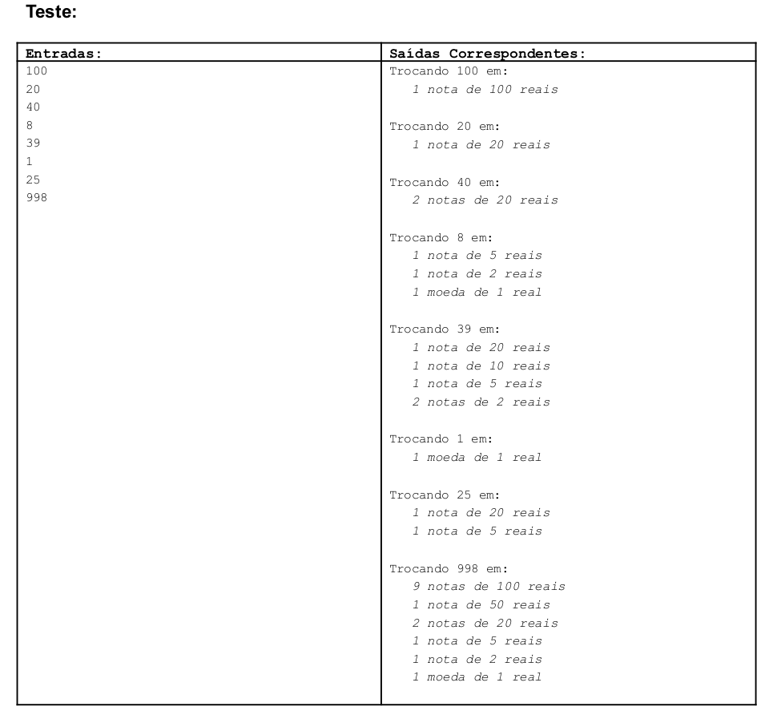
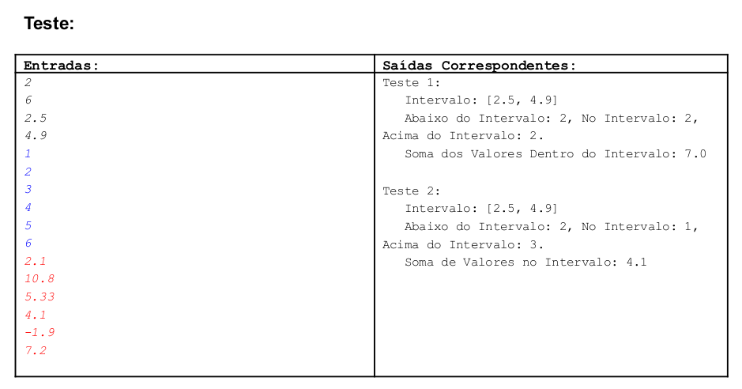

# QUESTÕES 1 E 2 DA PRIMEIRA AVALIAÇÃO A DISTANCIA DA DISCIPLINA FUNDAMENTOS DA PROGRAMAÇÃO PERTENCENTE AO CURSO DE TEC. EM CIENCIA DA COMPUTAÇÃO - UFF/CEDERJ 2022.1

## <b>Enunciados das questões:</b>
##
## 1ª Questão:
##
Faça um programa que leia da entrada padrão linhas até que uma vazia seja digitada. Para
cada linha lida, exceto a vazia, suponha que seja um número inteiro maior que zero.
Suponha que este número inteiro é o valor a ser trocado em um número mínimo de cédulas
e/ou moeda. As cédulas possuem valor: 100, 50, 20, 10, 5, 2 reais e a moeda seja de 1
real. Veja o teste a seguir e obedeça rigidamente as escritas na saída padrão,
considerando singular ou plural de notas em cada caso, bem como a devida tabulação.



##
## 2ª Questão:
##
Faça um programa que leia na primeira linha da entrada padrão a quantidade de testes,
chamada aqui de qtdTestes, a serem lidos oportunamente. Na segunda linha é lida a
quantidade de valores de cada teste, chamada aqui de qtdValoresTeste. Na terceira linha
um valor mínimo de um intervalo de valores que serão classificados os valores de cada
teste. Na quarta linha é lido o valor máximo do intervalo de classificação. Nas linhas
seguintes os valores de cada teste devem ser lido. Classifique os valores de cada teste e
escreva na saída padrão quantos valores ficam abaixo do mínimo, quantos ficam dentro do
intervalo e quantos ficam acima do máximo. Além disso, escreva também a soma dos
valores dentro do intervalo. Siga rigidamente a formatação das escritas na saída padrão.



##
## <b>Detalhes do desenvolvimento:</b>
##
As aplicações foram desenvolcidas utilizando como linguagem principal python na versão 3.x e o paradigma procedural, em virtude do ensino de funções da linguagem ainda não terem sido apresentados pelo curso no momento da execução dos exercícios.

##
## <b>Como rodar as aplicações localmente:</b>
##
Inicialmente tenha instalado em sua máquina a ferramenta de versionamento git e em seguida rode em um terminal o comando abaixo:
```
git clone https://github.com/LeoCosta-dev/AD1_fundamentos_de_programacao_UFF.git && cd /AD1_fundamentos_de_programacao_UFF
```

Para que os scripts sejam executados corretamente, a máquina deve possuir instalado o pacote de desenvolvimento python versão 3.x ou superior caso exista. Em sistemas Linux o mesmo já vem instalado por padrão na maioria das distribuições bastando rodar em um terminal o comando abaixo:

```
python3 <nome_do_script>
```

Para sistemas Windows ou Mac verificar o passo a passo para instalação da ferramenta <a href="https://www.python.org/downloads/">clicando aqui!</a> Após a instalação seguir o mesmo procedimento adotado em sistemas Linux.